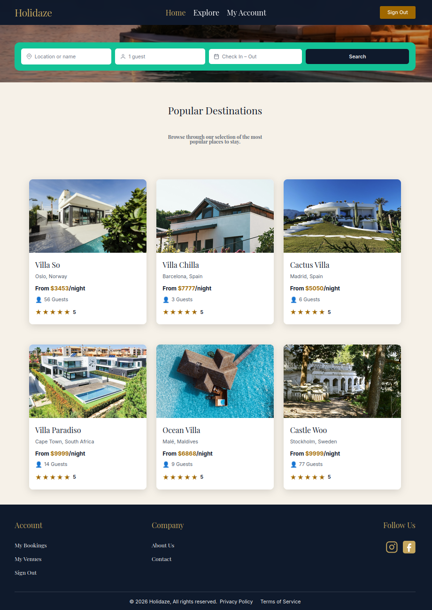
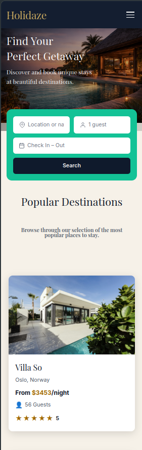

# Holidaze Noroff Exam

Holidaze is a booking platform for accommodation where users can explore venues, view availability, and complete bookings.

The platform has two main user groups:

1. Travellers (Customer)
2. Venue Managers

## Table of Contents

- [About Holidaze](#about-holidaze)
- [Target Audience](#target-audience)
- [Project Resources](#project-resources)
- [Screenshots](#screenshots)
- [Tech Stack](#tech-stack)
- [Installation](#installation)
- [Environment Variables](#environment-variables)
- [Testing](#testing)
- [Accessibility & Validation](#accessibility--validation)
- [Scripts](#scripts)

## About Holidaze

Holidaze is designed to make booking stays simple for travellers while keeping venue management straightforward for owners.

Core goals:

- Fast and simple booking flow
- Clear venue details, pricing, and availability
- Easy venue management for non-technical users

## Live Demo
[Holydaze](https://holydayz.netlify.app)

## Screenshots

### Desktop View



### Mobile View



## Features

- User registration and login
- Venue browsing and search
- Venue booking system
- Venue manager dashboard
- Responsive mobile-first design
- Form validation
- Automated testing

## Target Audience

### Primary Audience: Travellers

Suggested realistic target group:

- Young adults aged 20-35
- Students and early-career professionals
- Digital-first users
- Primarily booking from mobile devices
- Want quick and easy booking
- Compare options before choosing
- Care about price and amenities

### Secondary Audience: Venue Managers

Who they are:

- Small property owners and renters
- Need simple property administration
- Not necessarily highly technical users

### Qualitative Insights

- Users want fast booking
- Users need visible availability
- Users prefer simple navigation

### Design Decisions Based on Research

- Mobile-first layout
- Clear price display
- Calendar visible on venue page
- Simplified admin dashboard

## Project Resources

- [Gantt Chart for Project Timing](https://github.com/users/Padletut/projects/3/views/4)
- [Kanban Project Board](https://github.com/users/Padletut/projects/3/views/1)
- [Repository](https://github.com/Padletut/holidaze-noroff-exam)
- [Hosted Application Demo](https://holydayz.netlify.app)
- [Design Prototype (Desktop)](https://www.figma.com/proto/9FZzqTrAYie2SArwdl0BCe/Holydaze?node-id=2503-1943&t=ZX5BvzBLeuPsDkgf-1&scaling=scale-down&content-scaling=fixed&page-id=2503%3A15&starting-point-node-id=2503%3A1944&show-proto-sidebar=1)
- [Design Prototype (Mobile)](https://www.figma.com/proto/9FZzqTrAYie2SArwdl0BCe/Holydaze?node-id=2530-1155&t=9Vvt3X6Fr5rOhnl4-1&scaling=scale-down&content-scaling=fixed&page-id=2503%3A15&starting-point-node-id=2530%3A2599&show-proto-sidebar=1)
- [Style Guide](https://www.figma.com/design/9FZzqTrAYie2SArwdl0BCe/Holydaze?node-id=2733-5724&t=dflh5i4FIEYe5uWC-1)

## Tech Stack

- React 19
- React Router
- Zustand
- Vite
- Vitest
- Tailwind CSS 4
- Sass
- ESLint + Prettier
- Playwright
- JSDoc

## Installation

Clone the project and install dependencies:

```bash
git clone https://github.com/Padletut/holidaze-noroff-exam
cd holidaze-noroff-exam
npm install
```

Start development server:

```bash
npm run dev
```

## Environment Variables

The project can use environment variables for API configuration.

1. Create a `.env` file in the project root.
2. Add your frontend variables with the `VITE_` prefix.
3. Add test credentials for Playwright E2E tests.

Example:

```env
VITE_API_BASE_URL=https://api.noroff.dev
VITE_API_KEY=your_api_key_here
TEST_EMAIL=your_test_user_email
TEST_PASSWORD=your_test_user_password
```

Variables must start with `VITE_` to be available in the frontend.

`TEST_EMAIL` and `TEST_PASSWORD` are used by the Playwright E2E test suite. Some venue management tests also require the test account to have venue manager permissions.

## Testing

The project includes automated test coverage with a total of 255 tests.

- Unit/integration tests run with Vitest
- End-to-end tests run with Playwright

Run tests:

```bash
npm run test
npm run e2e
```

## Accessibility & Validation

The project was tested using:

- WAVE accessibility evaluation tool
- W3C HTML Validator

Focus areas included:

- Semantic HTML
- Keyboard navigation
- Color contrast
- Accessible forms and labels

## Scripts

- `npm run dev` - Start Vite development server
- `npm run build` - Build for production
- `npm run preview` - Preview production build
- `npm run lint` - Run ESLint
- `npm run test` - Run Vitest tests
- `npm run e2e` - Run Playwright end-to-end tests
- `npm run generate-docs` - Generate JSDoc documentation

## AI Generated Assets

- The homepage hero image was generated using ChatGPT image generation tools.